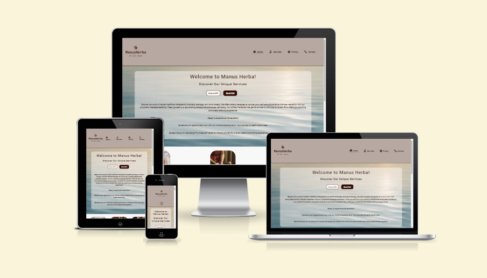

# Manus Herba - Herbal, Lymphatic drainage and Zone therapy website

Visit the deployed site: [Manus Herba](https://jaqikal.github.io/wellness-therapy/) 

**by Jacqueline Kalmár**

This website, dedicated to Herbal, Lymphatic drainage, and Zone therapy, is a static yet responsive front-end project. It was developed as part of the Code Institute's Diploma in Web Application Development Course for educational reasons. Crafted with HTML and CSS, the website aims at a seamless and user-friendly interface.  It highlights my interest for these therapeutic methods as a means of achieving body balance and wellness. This project serves as the first step in my path to mastering both front-end and back-end development, aiming to create an online space that is informative, easy to use, and effectively showcases these therapeutic services.

## CONTENTS

* [User Experience](#user-experience-ux)
  * [User Stories](#user-stories)

* [Design](#design)
  * [Colour Scheme](#colour-scheme)
  * [Typography](#typography)
  * [Imagery](#imagery)
  * [Wireframes](#wireframes)

* [Structure & Features](#structure--features)
  * [General Features on Each Page](#general-features-on-each-page)
  * [Features entire site](#features-entire-site)
  * [Future Implementations](#future-implementations)
  * [Accessibility](#accessibility)

* [Technologies Used](#technologies-used)
  * [Languages Used](#languages-used)
  * [Frameworks, Libraries & Programs Used](#frameworks-libraries--programs-used)

* [Deployment & Local Development](#deployment--local-development)
  * [Deployment](#deployment)
  * [Local Development](#local-development)
    * [How to Fork](#how-to-fork)
    * [How to Clone](#how-to-clone)

* [Testing & Defects(Bugs)](#testing--defects(bugs))

* [Credits](#credits)
  * [Code Used](#code-used)
  * [Content](#content)
  * [Media](#media)
  * [Acknowledgments](#acknowledgments)

---

## User Experience (UX)

### User Stories

#### First Time Visitor Goals

* **User story 1: As a first-time visitor**
  * I want to easily find information about the different therapies offered.
* **User story 2: As a first-time visitor**
  * I need to clearly understand how to get in contact and or book an appointment.

#### Returning Visitor Goals

* **User story 3: As a returning visitor**
  * I want to easily purchase gift cards, having already experienced the benefits of the therapies myself.

#### Frequent Visitor Goals

* **User story 4: As a frequent visitor**
  * I want a simple way to provide feedback or suggestions.

---

## Design

I chose to use a colour scheme that is down-to-earth to evoke calmness and professionalism. I ensured good contrast for readability, especially between text and background colors.
I used colour sparingly to highlight key areas like headings or important features.

### Colour Scheme

Soft blues, greens, and neutral brown/beige hues are often associated with health and wellness.
I've used:
* #301301 and #fdf8f5 as primary color for body, heading and paragraph.
* #800000 for highlighting headings and buttons
* #ded9db for header and footer background.
* #0000ff as hover effect on buttons, links and giftcard images.
* #503429, 
* #dbd3d0, 
* #e1dad7
* #fdf8f5
* #ffffff as effect on buttons when hovering

 [Manus Herba website](documentation/doc-image/colorscheme.png)

### Typography

* Google Fonts was used to import the chosen fonts for use in the site. I used [Google Fonts](https://fonts.google.com/) as it doesn't require you to download the font.
* I've included all weights to have the possibility of variation.
* My choice was based on readability and that I find the fonts to convey a neutral, easy to read feeling.
* [Roboto](https://fonts.google.com/specimen/Roboto?preview.text=Manus%20Herba%20-%20Herbal,%20Lymphatic%20drainage%20and%20Zone%20therapy%20website=roboto) for headings H1-H6 & paragraph.
* [Open sans](https://fonts.google.com/?preview.text=Manus%20Herba%20-%20Herbal,%20Lymphatic%20drainage%20and%20Zone%20therapy%20website&query=Open+sans) for body text.

### Imagery

Images used on this website have been sourced from free online resources, either generated by AI technology or obtained from Wikimedia Commons. Each image has been carefully selected to enhance the content and provide a visually engaging experience for our visitors.

### Wireframes

Wireframese created for mobile, tablet and desktop using 'Balsamiq'
 

## Structure & Features

The site has a simple structure made up of 7 pages plus 3 additional subpages.

  --   Insert IMAGE per Feature  --

* Home page / landing page - A short introduction to the therapy types with call to action buttons.
* Therapy content page - Exploring all the therapy forms, short blurb of what to expect.
* Shop - A page where I offer to purchase gift cards.
* Contact -  A page where one can book the either type of therapy and or leave feed-back.
* Privacy policy - Outlines data handling, user rights, and privacy practices on website.
* Cookies - Details website's use of cookies and user consent requirements.
* There are also two additional subpages:
  * GDPR
  * A thank you page for when a user has submitted a form.
  * A 404 page for when user land on a non-existent page.

### General features on each page

All Pages on the website are responsive and have:

* a favicon in the browser tab
* fixed navbar at the top for desktop and tablet users, enabling easy navigation to any section at any time – ideal for returning visitors familiar with the layout. On mobile devices, the navbar scrolls with the page to optimize screen space and enhance user experience.
* Additionally, every page includes a footer with links to the enteprise's social media, ensuring constant connectivity and engagement. 
* The website includes payment links that will provide convenient and secure transaction options in future versions when it becomes 'shopified.'

### Features entire site

* Favicon
  * *add  screenshot*
* Hero
  * *add  screenshot*
* Nav bar
  * *add  screenshot*
* Footer
  * *add  screenshot*
* Home page / landing page
  * *add  screenshot*
* Service page
  * *add  screenshot*
* Shop page
  * *add  screenshot*
* Pricing page
  * *add screenshot*
* Contact page
  *add screenshot
* Privacy policy page
  * *add  screenshot*
* Cookies page
  * *add  screenshot*
* GDPR page
 *  *add screenshot*
* A thank you page for when a user has submitted a form.
  * *add  screenshot*
* A 404 page for when user land on a non-existent peage.
  * *add  screenshot*

### Future Implemantations
Possible future implemantaions would be to 'shopify' the site, with all that comes with that. Smaller steps on the way are:
* A booking form with calendar
* A separate feedback form
* A search function
* Possibility to bookmark ones favourites
* An FAQ page
* A chat-bot
* A check-out procedure

### Accessibility

While developing the website, I've carefully focused on maximizing its accessibility. This goal was achieved through the following methods:

* [Wave Web Accessibility Evaulation Tool](https://wave.webaim.org/)
  * Using semantic HTML.
  * Using a hover state on all buttons on the site to make it clear to the user if they are hovering over a button.
  * Choosing a sans serif font for the site - these fonts are suitable for people with dyslexia.
  * Ensuring that there is a sufficient colour contrast throughout the site.

---

## Technologies Used

### Languages Used

[HTML](https://en.wikipedia.org/wiki/HTML) and [CSS](https://en.wikipedia.org/wiki/CSS) were used to create this website.

### Frameworks, Libraries & Programs Used

* [Am I Responsive?](http://ami.responsivedesign.is/) - To show the website image on a range of devices.
* [ASPOSE](https://products.aspose.app/pdf/sv/conversion/jpg-to-webp#): Used to convert image to WEBP.
* [Balsamiq](https://balsamiq.com/) - Used to create wireframes.
* [Birme](https://www.birme.net/) - To resize images and change to webp format.
* [Coolors](https://coolors.co/) - Used to create the colour scheme palette.
* [CSS Validation Service](https://jigsaw.w3.org/css-validator/#validate_by_input) - Used to check code ensuring that my CSS is error-free and adheres to the latest web standards.
* [DevTools](https://developer.chrome.com/docs/devtools) -  help in edit pages on-the-fly and diagnose problems quickly.
* [Diffchecker - text](https://www.diffchecker.com/text-compare/) - used to check code snippets
* [Favicon.io](https://favicon.io/) - To create favicon.
* [Font Awesome](https://fontawesome.com/) - For the iconography on the website.
* [Git](https://git-scm.com/) - For version control.
* [Github](https://github.com/) - To save and store the files for the website.
* [Google Fonts](https://fonts.google.com/) - To import the fonts used on the website.
* [Google Dev Tools](https://developers.google.com/web/tools)- To troubleshoot and test features, solve issues with responsiveness and styling.
* [Markup Validation Service](https://validator.w3.org/) - Used to check code ensuring that my HTML is error-free and adheres to the latest web standards.
* [Shields.io](https://shields.io/) - To add badges to the README.
* [Tiny PNG](https://tinypng.com/) - To compress images.
* [Visual Studio Code](https://code.visualstudio.com/) - a free and open-source code editor
* [Web Disability Sim](https://chrome.google.com/webstore/detail/web-disability-simulator/olioanlbgbpmdlgjnnampnnlohigkjla) - a google chrome extension that allows you to view your site as people with accessibility needs would see it.
* [Webpage Spell-Check](https://chrome.google.com/webstore/detail/webpage-spell-check/mgdhaoimpabdhmacaclbbjddhngchjik/related) - a google chrome extension that allows you to spell check your webpage. Used to check the site and the readme for spelling errors.

## Deployment & Local Development

### Deployment

Github Pages was used to deploy the live website. The instructions to achieve this are below:

1. Log in (or sign up) to Github.
2. Find the repository for this project, [JaqiKal/wellness-therapy](https://github.com/JaqiKal/wellness-therapy)
3. Click on the Settings link.
4. Click on the Pages link in the left hand side navigation bar.
5. In the Source section, choose main from the drop down select branch menu. Select Root from the drop down select folder menu.
6. Click Save. Your live Github Pages site is now deployed at the URL shown.

This site is deployed using GitHub Pages - [Manus Herba](https://jaqikal.github.io/wellness-therapy/services.html)

### Local Development

#### How to Fork

To fork the wellness-therapy repository:

1. Log in (or sign up) to Github.
2. Go to the repository for this project, [JaqiKal/wellness-therapy](https://github.com/JaqiKal/wellness-therapy)
3. Click the Fork button in the top right corner.

#### How to Clone

To clone the zone-lymphatic-therapy repository:

1. Log in (or sign up) to GitHub.
2. Go to the repository for this project, [JaqiKal/wellness-therapy](https://github.com/JaqiKal/wellness-therapy)
3. Click on the code button, select whether you would like to clone with HTTPS, SSH or GitHub CLI and copy the link shown.
4. Open the terminal in your code editor and change the current working directory to the location you want to use for the cloned directory.
5. Type 'git clone' into the terminal and then paste the link you copied in step 3. Press enter.

---

## Testing & Defects(Bugs)

All code have been validated throught the [W3C CSS Validator](https://jigsaw.w3.org/css-validator/#validate_by_input) [and W3C HTML Validator](https://validator.w3.org/)

### HTML validation

* *Add screenshot of HTML checker result per page*

### CSS Validation

* *Add screenshot of HTML checker result per page*

### Accessibility
* I ran the site through the Wave Web Accessibility Evaulation Tool. The tool did not raise specific isssues, it pointed att good practice. 
  * Though after the the test I did make the buttons larger and chose a darker color for the fa-brands icons in the footer.
  * I also changed the link colour to blue when hovered upon, blue is often a good choice as it is generally distinguishable by people with various forms of color blindness.

### Performance
* *I ran the site through Google Chrome Dev Tools' Lighthouse to check on its performance. List whatever findings, rememeber to add screenshots of the lighthouse result*.

### Responsiveness
* Tested on Galaxy S20, Iphone Pro 13, 27" Samsung screen, 24" Imac.

### Browser compability
* *The site was tested on the following browsers*
  * Google Chrome, version 120.0.6099.225 (Official Build) (64-bit)
  * Mozilla Firefox, version 122.0.0 (64-bit)
  * Microsoft Edge, version 120.0.2210.144 (Official build) (64-bit)

*Note whatever finding*

* Defects (bugs) & fixes

### Known bugs

*To be added!*

### Testing User Stories

Please refer to [TESTING.md](TESTING.md) file for all testing carried out.

### Unolved Bugs

| No | Bug | How I solved the issue |
| :--- | :--- | :--- |
| [1] | In Chrome browser & MS Edge the bottom rigth corner of the navbar is hidden under the browser schrollbar. Not present in Firefox.| Not Solved |

### Solved Bugs

| No | Bug | How I solved the issue |
| :--- | :--- | :--- |
| [1] | :--- | :--- |
| [2] | :--- | :--- |
| [3] | :--- | :--- |
| [4] | :--- | :--- |

---

## Credits

### Code used

### Code Used

* I encountered a challenge with styling an active menu item. Initially, using a class active selector with border-bottom resulted in a line that was wider than desired. To resolve this, I sought advice on Slack and supplemented it by researching pseudo-elements on W3Schools and MDN, and through experimentation. This process led to a solution, further inspired by a specific Stack Overflow discussion related to creating a vertical line for active menu items [found here](https://stackoverflow.com/questions/68834109/how-do-i-get-a-vertical-line-to-the-left-of-the-active-menu-item)

* I sought a straightforward method to enhance the footer and header and discovered an approach for creating rounded corners. This technique, inspired by an example from [w3schools](https://www.w3schools.com/css/css3_borders.asp) involves using CSS3 properties for borders. This has effectively given a more polished look to these website sections.

* I wanted to highlight the giftcard images in shop with something more than scaling effect up hover. Added dropshadow when hovering, amended from [mdn web doc](https://developer.mozilla.org/en-US/docs/Web/CSS/filter-function/drop-shadow).

* [Favicon.io](https://favicon.io/favicon-converter/): Used to create the site Favicon and provided the code in the head of all pages.

* [Privacy Policy Generator](https://www.privacypolicygenerator.info/): Used to create content in [Privacy Policy page](https://jaqikal.github.io/wellness-therapy/privacy-policy).

* 

### Content

Website content crafted by the developer for personalized, authentic information.

###  Media

* In 'services.html' I added a video as an example. [Video credit](https://youtu.be/mhpWAECfMPw?si=Cob7xsILGohn9oRX)

###  Acknowledgments'

I would like to acknowledge the following people:

* My mentor [Jubril Akolade](https://github.com/jubrillionaire/) for all his help and advice throughout the project
* The whole team at [Code Institute](https://codeinstitute.net) for their teaching and support
* A special shoutout to Kenan Wright Community CI for "gitpod-and-code-anywhere" for helping me to get the CA issues sorted!
